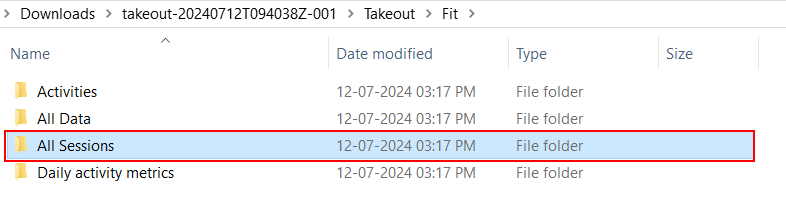

## Installation
    1.Make sure you have Node.js installed.
    2.Clone this repository: git clone https://github.com/vrushali-d/FitDataAnalysis
    3.Install dependencies: npm install
    4.node index.js

## Usage
    1.Navigate to the project directory.
    2.Replace the contents of the “All Sessions” folder with your own Google Fit data.

## Google Fit Data Download
[How to download google fit data](https://support.google.com/fit/answer/3024190?hl=en)

Copy All Sessions folder to repository
